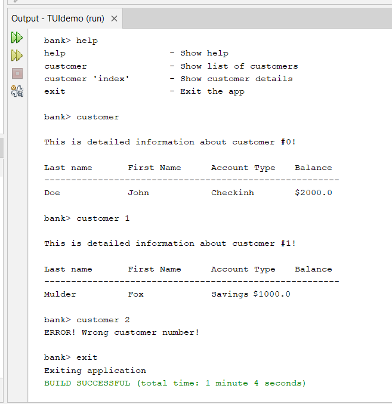
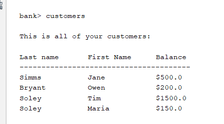
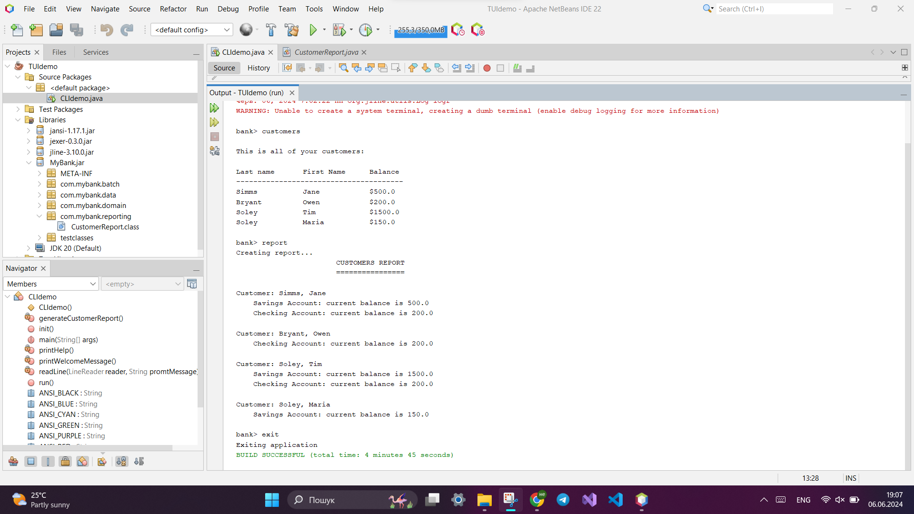

# UI Lab 2 


## Просто запуск коду



## Завдання на 4

Додала код для читання з файлу з минулої ПР



## Завдання на 5



Підключила com.mybank.reporting.CustomerReport;

### Додані шматки коду

```java
     } else if ("report".equals(line)){
         System.out.println("Creating report...");
         generateCustomerReport();
```

```java
  private void generateCustomerReport(){
        CustomerReport custReport = new CustomerReport();
        custReport.generateReport();
    }
```

Дуже хотілося б побачити роботу коду в зовнішній консолі, але після майже години спроб різних варіантів він так і не запустився

---
**УВАГА! Не забуваємо здавати завдання через Google Classroom та вказувати посилання на створений для вас репозиторій!**

Також пам'ятайте, що ніхто не заважає вам редагувати файл README у вашому репозиторії😉.
А ще - дуже раджу спробувати нову фічу - інтеграцію з IDE REPL.it (хоч з таким завданням вона може й не впоратись, однак, цікаво ж!).


 
[](https://gitter.im/PPC-SE-2020/OOP?utm_source=badge&utm_medium=badge&utm_campaign=pr-badge)
